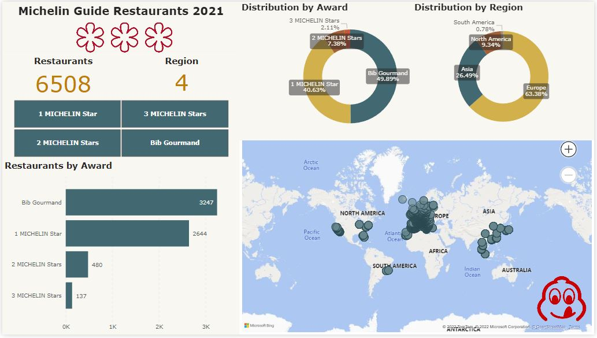

# Project: Business Intelligence with PowerBI

## 1. Project Overview
The goal of this project was to practice with visualization tools, in this case with **PowerBI**.

With aim of investing the time on practicing with PowerBI to the maximum extent, I've chosen a raw dataset from [Kaggle](https://www.kaggle.com/datasets/ngshiheng/michelin-guide-restaurants-2021) from where a brief overview I saw I can get insights without further data processing, so I can directly import the raw data, start exploring it using PowerBI, and create a Dashboard to show these insights derived from the data.

## 2. Project Steps 
As part of my learning process, I reached to the conclusion that following **tips** are important before and during the development of a Dashboard:
- Show clear and relevant information only. Remove redundant / not useful information.
- Provide format. Whenever possible, do not keep on default settings.
- Whenever numbers are shown, make sure they have same format (units and decimals) and all of them can be properly seen.
- Give structure to the layout and color design.
- Dashboard size is limited, so it is important to fit to board size and avoid scrolls.

Having above in mind, I structured the project in following **main steps**:
2.1. Explore the data inside PowerBI (section "Data"), to extract the variety of visualizations that can be potentially included in my Dashboard.
2.2. Along with the tips mentioned above, I started doing a mock-up of the key graphs to show, with objective of setting the main structure. 
2.3. Format and filter the data to show. 
2.4. Fit everything to size and format the graphs plotted: slicers, cards, bar chart, donut chart, map.
2.5. Add headers / titles wherever deemed useful. 
2.6. Color design.
2.7. Added some pictures, added action to one of them to source dataset URL.
2.8. Edit interactions between graphs, kept bar chart as fixed, with no interactions with other graphs.
2.9. Did some practice with roles management, and created one role per region as sample. 
2.10. Finally, I dived into self-learning about how PowerBI interacts with PowerQuery and how to publish reports online in PowerBI Service.

## 3. Dashboard

## 4. Conclusions 

## 5. Lessons learned

5.1. One of the main challenges was to select a raw dataset to be used for the dashboard creation, without the need of data processing.  
My main lesson learned with regards to dataset selection is that rather than investing time to select an "apparently clean dataset", it would have been better to invest time on doing some data wrangling/cleaning by myself by using Python/SQL.
Despite at first sight the dataset looked as "clean", the reality is that it was not cleaned at all and I believe I could have extracted much more insights if I had processed the data first. 
As for example, adding a column for Country, format price to same currency (e.g. EUR or USD), or format the type of Cuisine, could lead to additional insights/meaningful information to show in the Dashboard. 

5.2. Another important lesson learned during my practice is that PowerBi is a powerful tool for data visualization, with an intuitive and user-friendly interface.
However, it has so many features, functions, tools, formatting options, etc. that requires time and practice. 

5.3. "Learning by doing" and "practice makes perfect" are the best tecniques to get to be a PowerBI user expert!

**Thanks for reading! :)**
